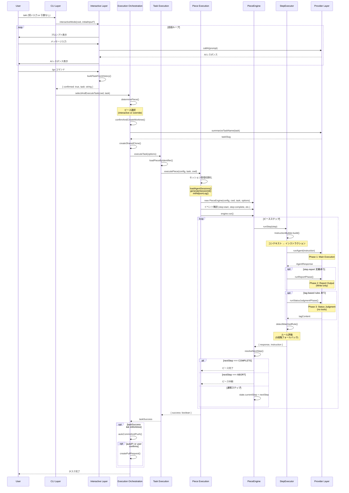
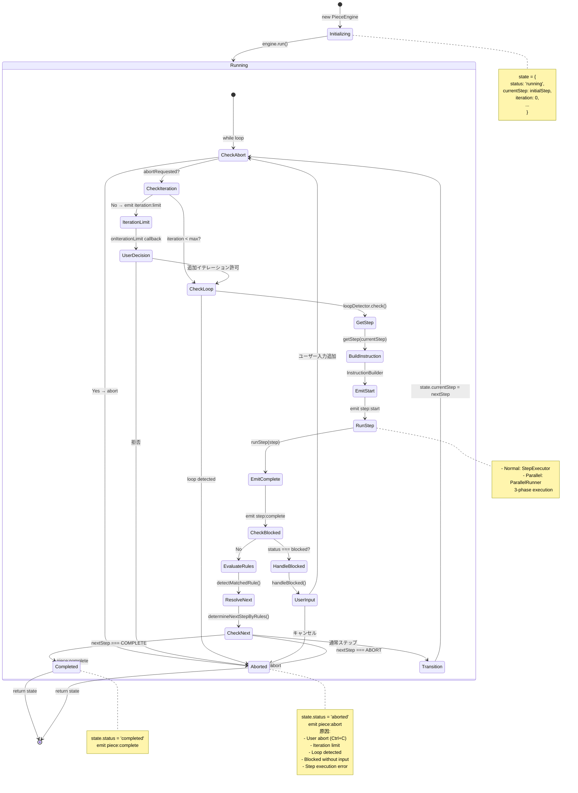
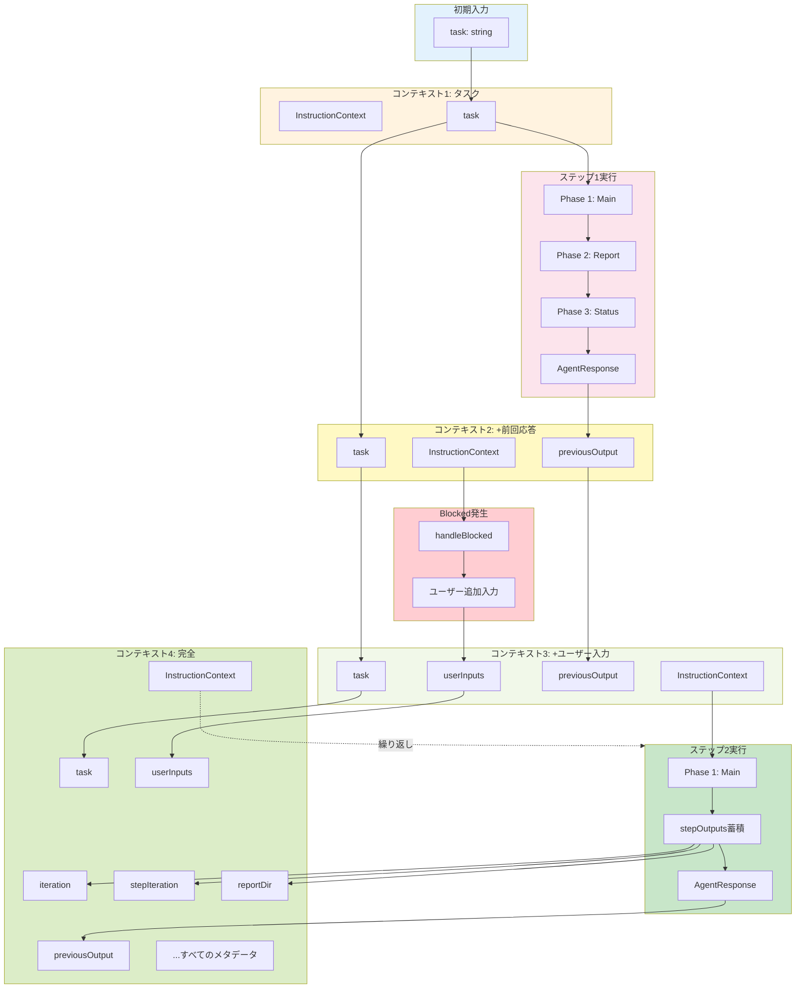

# TAKTデータフロー図解

このドキュメントでは、TAKTのデータフローをMermaid図で可視化します。

## 目次

1. [シーケンス図: インタラクティブモードからピース実行まで](#シーケンス図-インタラクティブモードからピース実行まで)
2. [フローチャート: 3フェーズステップ実行](#フローチャート-3フェーズステップ実行)
3. [フローチャート: ルール評価の5段階フォールバック](#フローチャート-ルール評価の5段階フォールバック)
4. [ステートマシン図: PieceEngineのステップ遷移](#ステートマシン図-pieceengineのステップ遷移)

---

## シーケンス図: インタラクティブモードからピース実行まで



---

## フローチャート: 3フェーズステップ実行

```mermaid
flowchart TD
    Start([ステップ実行開始]) --> BuildInstruction[InstructionBuilder.build]
    BuildInstruction --> Phase1{Phase 1:<br/>Main Execution}

    Phase1 --> ContextBuild[コンテキスト収集]
    ContextBuild --> |7セクション自動注入| AssemblePrompt[プロンプト組み立て]
    AssemblePrompt --> |プレースホルダー置換| CompleteInstruction[完全なインストラクション]

    CompleteInstruction --> RunAgent[runAgent]
    RunAgent --> ProviderCall[provider.call]
    ProviderCall --> |onStream callback| StreamUI[UI表示]
    ProviderCall --> Response1[AgentResponse]

    Response1 --> CheckReport{step.report<br/>定義あり?}
    CheckReport -->|Yes| Phase2[Phase 2:<br/>Report Output]
    CheckReport -->|No| CheckTag{tag-based<br/>rules あり?}

    Phase2 --> ResumeSession1[セッション継続<br/>sessionId同じ]
    ResumeSession1 --> ReportBuilder[ReportInstructionBuilder.build]
    ReportBuilder --> WriteOnly[Write-only tools]
    WriteOnly --> RunReport[runAgent<br/>レポート出力]
    RunReport --> CheckTag

    CheckTag -->|Yes| Phase3[Phase 3:<br/>Status Judgment]
    CheckTag -->|No| RuleEval[detectMatchedRule]

    Phase3 --> ResumeSession2[セッション継続<br/>sessionId同じ]
    ResumeSession2 --> StatusBuilder[StatusJudgmentBuilder.build]
    StatusBuilder --> NoTools[Tools: なし<br/>判断のみ]
    NoTools --> RunStatus[runAgent<br/>ステータス出力]
    RunStatus --> TagContent[tagContent:<br/>STEP:N タグ]

    TagContent --> RuleEval
    RuleEval --> FiveStageFallback[5段階フォールバック]

    FiveStageFallback --> Stage1{1. Aggregate?}
    Stage1 -->|Yes| AllAny[all/any 評価]
    Stage1 -->|No| Stage2{2. Phase 3 tag?}

    AllAny --> Matched[マッチ!]

    Stage2 -->|Yes| Phase3Tag[STEP:N from<br/>status judgment]
    Stage2 -->|No| Stage3{3. Phase 1 tag?}

    Phase3Tag --> Matched

    Stage3 -->|Yes| Phase1Tag[STEP:N from<br/>main output]
    Stage3 -->|No| Stage4{4. AI judge<br/>ai rules?}

    Phase1Tag --> Matched

    Stage4 -->|Yes| AIJudge[AI evaluates<br/>ai conditions]
    Stage4 -->|No| Stage5[5. AI judge<br/>fallback]

    AIJudge --> Matched
    Stage5 --> AIFallback[AI evaluates<br/>all conditions]
    AIFallback --> Matched

    Matched --> UpdateResponse[response.matchedRuleIndex<br/>response.matchedRuleMethod]
    UpdateResponse --> StoreOutput[state.stepOutputs.set]
    StoreOutput --> End([ステップ完了])

    style Phase1 fill:#e1f5ff
    style Phase2 fill:#fff4e6
    style Phase3 fill:#f3e5f5
    style Matched fill:#c8e6c9
```



---

## フローチャート: ルール評価の5段階フォールバック

```mermaid
flowchart TD
    Start([ルール評価開始]) --> Input[入力:<br/>step, content, tagContent]

    Input --> Stage1{Stage 1:<br/>Aggregate評価<br/>親ステップ?}
    Stage1 -->|Yes| CheckAggregate{rules に<br/>allまたはanyあり?}
    CheckAggregate -->|Yes| EvalAggregate[AggregateEvaluator]
    EvalAggregate --> CheckAggResult{マッチした?}
    CheckAggResult -->|Yes| ReturnAgg[method: aggregate<br/>返却]
    CheckAggResult -->|No| Stage2

    CheckAggregate -->|No| Stage2
    Stage1 -->|No| Stage2{Stage 2:<br/>Phase 3 tag<br/>tagContent に<br/>STEP:N あり?}

    Stage2 -->|Yes| ExtractTag3[正規表現で抽出:<br/>STEP:(\d+)]
    ExtractTag3 --> ValidateIndex3{index が<br/>rules 範囲内?}
    ValidateIndex3 -->|Yes| ReturnTag3[method: phase3_tag<br/>返却]
    ValidateIndex3 -->|No| Stage3

    Stage2 -->|No| Stage3{Stage 3:<br/>Phase 1 tag<br/>content に<br/>STEP:N あり?}

    Stage3 -->|Yes| ExtractTag1[正規表現で抽出:<br/>STEP:(\d+)]
    ExtractTag1 --> ValidateIndex1{index が<br/>rules 範囲内?}
    ValidateIndex1 -->|Yes| ReturnTag1[method: phase1_tag<br/>返却]
    ValidateIndex1 -->|No| Stage4

    Stage3 -->|No| Stage4{Stage 4:<br/>AI judge<br/>ai rules あり?}

    Stage4 -->|Yes| FilterAI[aiルールのみ抽出<br/>ai 関数パース]
    FilterAI --> CallAI[AIJudgeEvaluator<br/>condition を評価]
    CallAI --> CheckAIResult{マッチした?}
    CheckAIResult -->|Yes| ReturnAI[method: ai_judge<br/>返却]
    CheckAIResult -->|No| Stage5

    Stage4 -->|No| Stage5[Stage 5:<br/>AI judge fallback<br/>全条件を評価]

    Stage5 --> AllConditions[全ルール条件を収集]
    AllConditions --> CallAIFallback[AIJudgeEvaluator<br/>全条件を評価]
    CallAIFallback --> CheckFallbackResult{マッチした?}
    CheckFallbackResult -->|Yes| ReturnFallback[method: ai_judge_fallback<br/>返却]
    CheckFallbackResult -->|No| NoMatch[null 返却<br/>マッチなし]

    ReturnAgg --> End([返却:<br/>index, method])
    ReturnTag3 --> End
    ReturnTag1 --> End
    ReturnAI --> End
    ReturnFallback --> End
    NoMatch --> End

    style Stage1 fill:#e3f2fd
    style Stage2 fill:#fff3e0
    style Stage3 fill:#fce4ec
    style Stage4 fill:#f3e5f5
    style Stage5 fill:#e8f5e9
    style End fill:#c8e6c9
    style NoMatch fill:#ffcdd2
```

---

## ステートマシン図: PieceEngineのステップ遷移



---

## データ変換の流れ

```mermaid
flowchart LR
    subgraph Input ["入力"]
        A1[ユーザー入力<br/>CLI引数]
        A2[会話履歴<br/>ConversationMessage]
    end

    subgraph Transform1 ["変換1: タスク化"]
        B1[isDirectTask判定]
        B2[buildTaskFromHistory]
    end

    subgraph Task ["タスク"]
        C[task: string]
    end

    subgraph Transform2 ["変換2: 環境準備"]
        D1[determinePiece]
        D2[summarizeTaskName<br/>AI呼び出し]
        D3[createSharedClone]
    end

    subgraph Execution ["実行環境"]
        E1[pieceIdentifier]
        E2[execCwd, branch]
    end

    subgraph Transform3 ["変換3: 設定読み込み"]
        F1[loadPieceByIdentifier]
        F2[loadAgentSessions]
    end

    subgraph Config ["設定"]
        G1[PieceConfig]
        G2[initialSessions]
    end

    subgraph Transform4 ["変換4: 状態初期化"]
        H[createInitialState]
    end

    subgraph State ["実行状態"]
        I[PieceState]
    end

    subgraph Transform5 ["変換5: インストラクション"]
        J[InstructionBuilder.build]
    end

    subgraph Instruction ["プロンプト"]
        K[instruction: string]
    end

    subgraph Transform6 ["変換6: AI実行"]
        L[provider.call]
    end

    subgraph Response ["応答"]
        M[AgentResponse]
    end

    subgraph Transform7 ["変換7: ルール評価"]
        N[detectMatchedRule]
    end

    subgraph Transition ["遷移"]
        O[nextStep: string]
    end

    A1 --> B1
    A2 --> B2
    B1 --> C
    B2 --> C

    C --> D1
    C --> D2
    D1 --> E1
    D2 --> D3
    D3 --> E2

    E1 --> F1
    E2 --> F2
    F1 --> G1
    F2 --> G2

    G1 --> H
    G2 --> H
    H --> I

    I --> J
    C --> J
    J --> K

    K --> L
    L --> M

    M --> N
    I --> N
    N --> O

    O -.-> I

    style Input fill:#e3f2fd
    style Task fill:#fff3e0
    style Execution fill:#fce4ec
    style Config fill:#f3e5f5
    style State fill:#e8f5e9
    style Instruction fill:#fff9c4
    style Response fill:#f1f8e9
    style Transition fill:#c8e6c9
```



---

## コンテキスト蓄積の流れ



---

## まとめ

これらの図は、TAKTのデータフローを以下の視点から可視化しています:

1. **シーケンス図**: 時系列での各レイヤー間のやりとり
2. **3フェーズフローチャート**: ステップ実行の詳細な処理フロー
3. **ルール評価フローチャート**: 5段階フォールバックの意思決定ロジック
4. **ステートマシン**: PieceEngineの状態遷移
5. **データ変換図**: 各段階でのデータ形式変換
6. **コンテキスト蓄積図**: 実行が進むにつれてコンテキストが蓄積される様子

これらの図を `data-flow.md` と合わせて参照することで、TAKTのアーキテクチャを多角的に理解できます。
